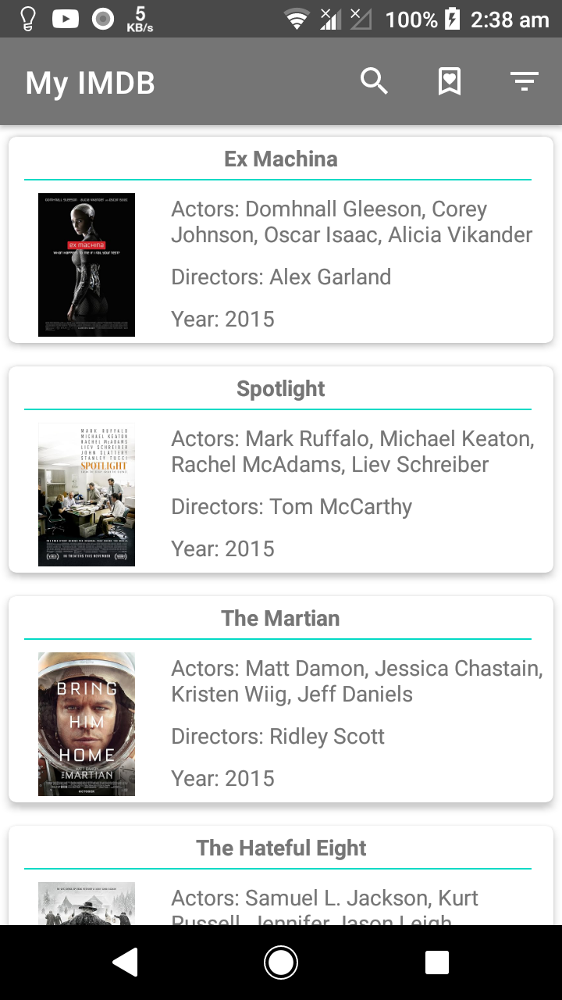
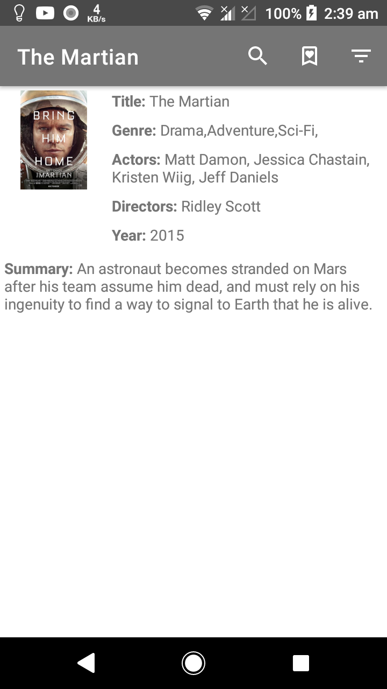

# 🎬 MyIMBD – Modern Movie App

A modern Android application inspired by IMDB, built to showcase clean architecture, modern Android tools, and offline-first capabilities.  
The app fetches movie data from a remote source once during the first launch and runs offline afterward.

---

## 📸 Screenshots
> * 
> * 

---

## 🎯 Objective

Build a simple yet well-architected IMDB-like app using **modern Android development practices** with the following capabilities:
- Fetch movie data on the splash screen (only once if not already stored)
- Display movies with search and filter
- Enable wishlist functionality
- Provide offline support
- Follow clean architecture principles

---

## 🧱 Core Features

- **List Movies** – Display a scrollable list of movies in reverse chronological order
- **Search** – Search movies by title or content
- **Filter** – Filter movies via genre dropdown
- **Splash Page** – Check internet and fetch/store data once
- **Wishlist** – Add movies to wishlist with animation to wishlist icon
- **Pagination** – Load 10 movies per scroll from local DB
- **Offline Support** – Store data locally using Room DB
- **Architecture** – MVVM or Clean Architecture with Repository Pattern
- **State Management** – StateFlow or Compose State
- **Dependency Injection** – Hilt for DI

---

## 🧪 Modularization
- **Modularization** – Separate :app, :domain, and :data modules

## 🛠 Tech Stack

- **Language:** Kotlin
- **UI:** XML (Later plan with Jetpack Compose, Material 3 )
- **Architecture:** MVVM or Clean Architecture
- **Persistence:** Room
- **DI:** Hilt
- **State Management:** StateFlow or Compose State (Plan for later)
- **Min SDK:** 24

---

## 📐 Architecture Overview

The app follows **MVVM / Clean Architecture** principles:
- **Domain Layer** – Business logic, use cases(plan for later)
- **Data Layer** – Repository, Room Database, Remote Data Source
- **UI Layer** – XML

---

## 📦 How to Build & Run

1. Clone the repository:
   ```bash
   git clone https://github.com/your-username/myimdb.git
   cd myimdb
   ```

2. Open the project in **Android Studio**

3. Sync Gradle and build the project

4. Run on an emulator or device (Min SDK 24)

---

## ⚙️ Setup & Installation (APK)

If you don’t want to build from source, you can directly install the APK:

1. Download the latest APK from the [Here](https://drive.google.com/file/d/1WsvmWdB-hANOPnXnkFEK6UPZlCoHVQoP/view) section. *(Replace `#` with your release link)*
2. Transfer the APK to your Android device.
3. Enable **Install from Unknown Sources** in your device settings.
4. Open the APK file and follow the installation prompts.
5. Launch the **MyIMBD** app and enjoy!

---

## 🧪 Bonus Features (Plan for later)

- **Target SDK** – Android SDK 36
- **Dark Theme** – Light/Dark mode toggle
- **Grid View Option** – Switch between list and grid layouts
- **Testing** – Unit tests for ViewModel or Repository
- **Animations** – Advanced Compose animations

---
